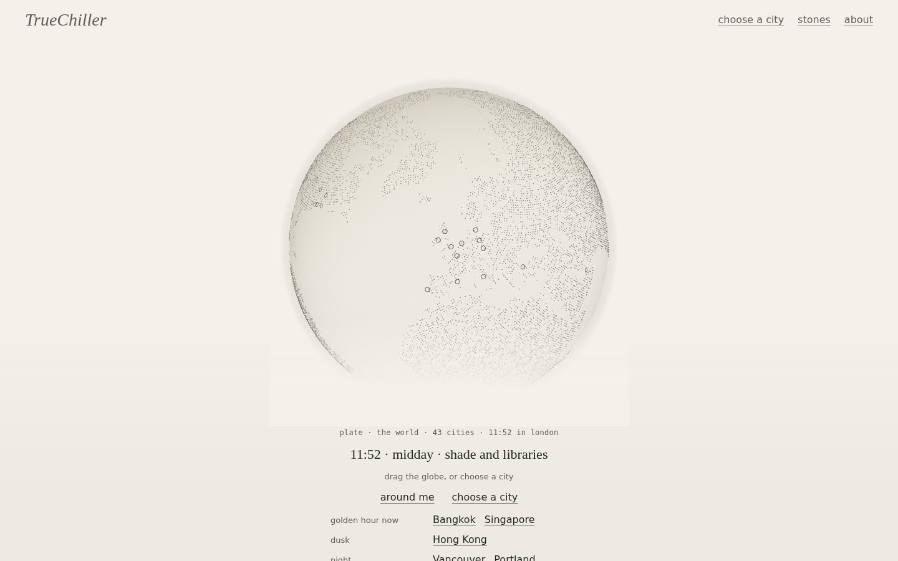
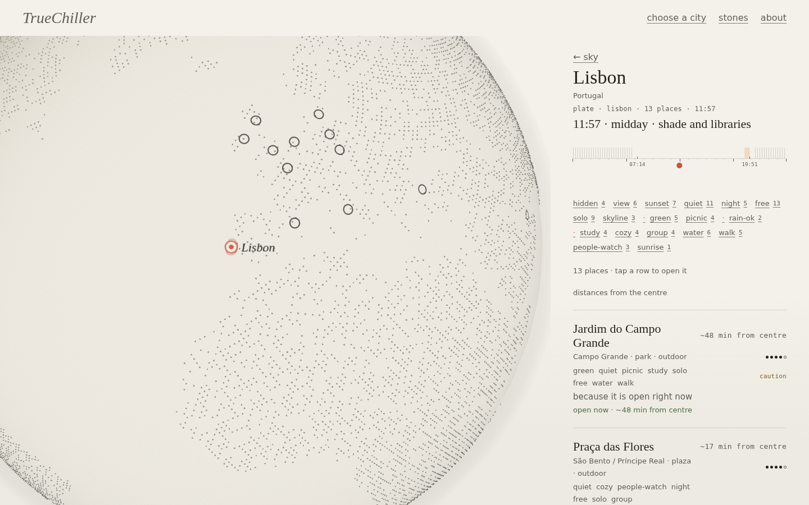
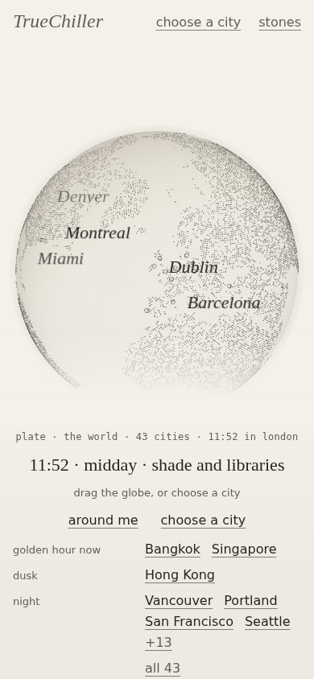

# Paurk

> Somewhere to breathe, wherever, whenever.

All the low-key ("lwk") chill spots around you, on a globe. A static web app: a matte porcelain globe on warm
paper shows 44 cities; pick one (or say *around me*) and get a ranked list of quiet parks, waterfronts,
viewpoints, gardens, cafés, libraries and public rooftops for **right now**: the time of day, the sun, the
weather and your distance all change the order and the words.

- **Plan:** `docs/PLAN.md` · **Design spec:** `docs/DESIGN.md` · **Research report:** `data/research-report.md`
- **Data:** `data/research/<city>.json` (one file per city, with sources and safety notes) → `src/data/spots.json`

## Run it

```bash
npm install
npm run dev        # http://localhost:5173
npm run build      # typecheck + production build to dist/
npm run preview    # serve dist/ on :4173
npm test           # vitest unit tests (geo, sun times, ranking, hours parser, poster, photos)
npm run shots      # headless Chromium screenshots + 44px tap-target check (needs `vite preview` running)
npm run build:data # regenerate src/data/spots.json and public/globe-dots.bin from data/research and world-atlas
```

## Deploy

Built for **Cloudflare Pages**. Connect the repository once and every push to `main` deploys; other branches get
their own preview URL.

| Setting | Value |
| --- | --- |
| Build command | `npm run build` |
| Build output directory | `dist` |
| Production branch | `main` |
| Node version | pinned to 22 by `.node-version` |

Leave `VITE_BASE` unset: the site is served from the root of a domain, and `base` already defaults to `/`. Set it
only when serving from a sub-path (`VITE_BASE=/paurk/ npm run build` for a GitHub Pages project site).

Routing is hash-based, so there are no deep-link 404s and no catch-all redirect rule is needed. `vite.config.ts`
emits `dist/_headers` on every build from the same policy it injects as a meta tag, so the Content-Security-Policy,
referrer and caching rules travel with the build rather than living in a dashboard.

What the first visit downloads, gzipped:

| | |
| --- | --- |
| App and the data lists and ranking need | 170 KB |
| Body font, self-hosted latin subsets | 34 KB |
| Third-party font stylesheet | 0.8 KB |
| Globe land data, delta-encoded and gzipped | 12.5 KB |
| three.js and the globe engine, after first paint | 137 KB |
| Blurbs, tips and sources, when a city is opened | 156 KB |

To deploy by hand instead of connecting Git: `npm run build && npx wrangler pages deploy dist`.

## What it does

| | |
| --- | --- |
| **Globe** | Custom three.js: dot-matrix land sampled from `world-atlas` at build time, the real day/night terminator (sub-solar point, refreshed every minute), a pencil halo, an 8-second breath, ring markers for cities, a dotted route of the cities you have visited this session. Drag, pinch/scroll, arrow keys, page up/down to step between cities, Enter/Escape. Falls back to a 2D `d3-geo` drawing without WebGL. |
| **Around me** | A row in *find* whose own sub line is the consent sentence, so the explanation comes before the browser is ever asked; looked at once, never stored. Finds the nearest city within 80 km, shows distance, walking time and a compass needle per spot, plus a compass loupe of the spots around you. Further away, it lists every city by distance; refused, it falls back to the full list. |
| **Whenever** | Sunrise, sunset and golden hour are computed on the device (SunCalc) per city. The horizon light on the page and the sphere follow the phase of day; a *sun-rule* dial lets you scrub the day (and pin a time into the link) to see what the picks would be at 21:30. |
| **Ranking** | "Right now" scoring: period of day × weather (Open-Meteo, keyless, optional) × your chosen vibes × distance × hours confidence. Every top pick explains itself in one line starting with *because*. At night, spots with a caution note sink below *better in daylight*. |
| **Spot page** | A deterministic *Sumi poster* is painted first; a photograph from the spot's Wikipedia article loads over it when one exists (fetched in your browser from Wikipedia's public API, with a Commons attribution link). Blurb, tip, best times, hours (*open now* only when the hours are unambiguous, otherwise *see hours*), *take care* note, sources, save, share, *breathe here*. |
| **Find** | One combobox over all 44 cities and all 604 places, opened from the header or with `/`. Ranks names, neighbourhoods, categories and vibes in tiers; every row carries that place's local clock, its period of day, and a countdown to what happens next there. Before you type a letter it already offers what the light is doing elsewhere, where you have been lately, and the whole city list. |
| **Saved** | Saved spots (localStorage) grouped by city; the globe fills the disc of cities that hold them. |
| **Access** | Every control is an underlined word with a 44 px hit box (checked by `npm run shots`); native dialogs; one polite live region; reduced-motion (*still*) mode; paper and slate themes; 4.5:1 text contrast under every horizon colour. |

## How the spots were gathered

The brief asked for research through Reddit. Reddit is not reachable from the environment this was built in
(the egress proxy blocks it and Reddit blocks the search tool's crawler), so:

1. **One research agent per city** ran at least nine web searches phrased Reddit-first (`reddit <city> chill spots`,
   `r/<sub> quiet places to relax`, hidden gems locals only, best free sunset spot, reading spots, quiet cafés,
   free rooftops, secret gardens, safe waterfront walks). Search engines surface Reddit-derived opinion through
   pages that republish it (Time Out "according to locals", city-hall "hidden gems" surveys, Teamblind, forums,
   substacks), and those are the sources cited. **No URL is cited unless it appeared in a search result.**
2. **One skeptical verify agent per city** confirmed each place exists and is public, applied the safety policy,
   sanity-checked coordinates against the city centre, confirmed the Wikipedia title that drives the photo, and
   wrote the file. All 44 cities went through this stage (604 spots; 389 with a confirmed photo title; 112 with
   a caution note). Each file records which checks were made by live search and which from reviewer knowledge.
3. `scripts/build-dataset.mjs` validates, de-duplicates and drops anything more than 80 km from its city.

Coordinates are approximate (each carries a confidence level). Hours change; the app only says *open now* when
the hours text is unambiguous.

## Safety policy

Only public places. Excluded: anything involving trespassing, abandoned or derelict sites, active industrial or
rail land, unlit isolated spots, bar-only or club venues. Legitimate public places with real after-dark concerns
are kept with a calm, specific *take care* note (lighting, company, terrain), shown as a word and a hollow ring,
never a red triangle. Night-time picks penalise caution spots and list them under *better in daylight*.

## Stack

Vite 8 · React 19 · TypeScript · three.js · d3-geo / topojson / world-atlas · SunCalc · vitest · Playwright (QA)
· Google Fonts (Cormorant Garamond, Zen Kaku Gothic New, DM Mono). No backend, no map tiles, no keys.

## Screens

| Sky | City | Spot (phone) |
| --- | --- | --- |
|  |  |  |
